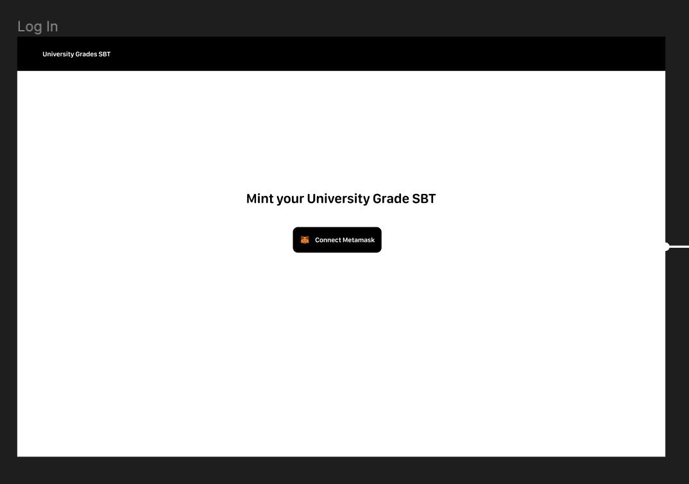
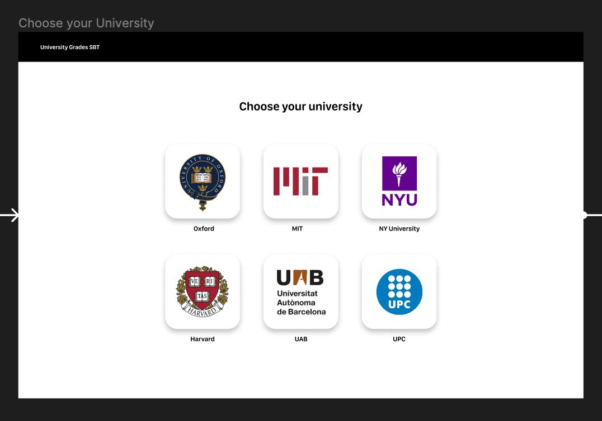
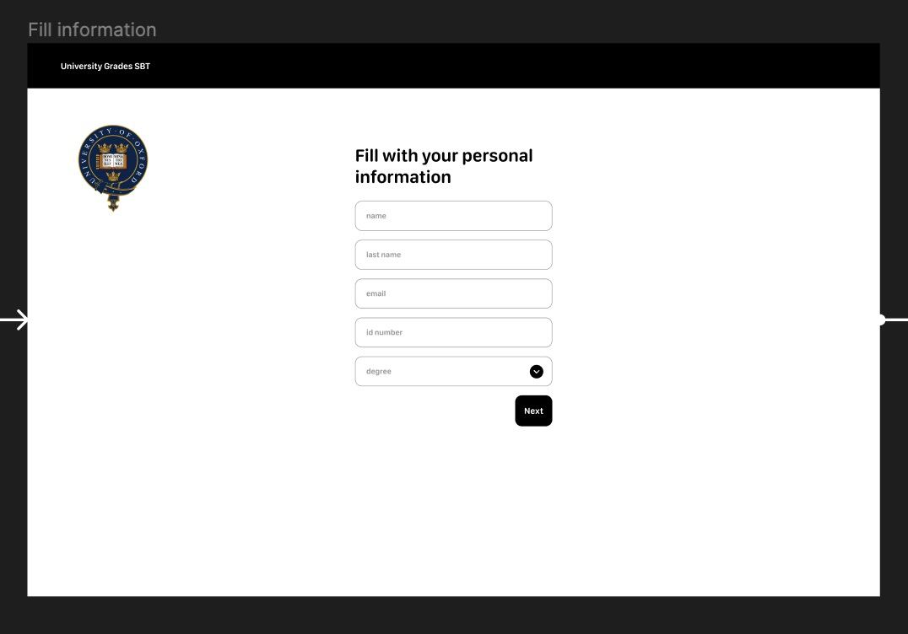
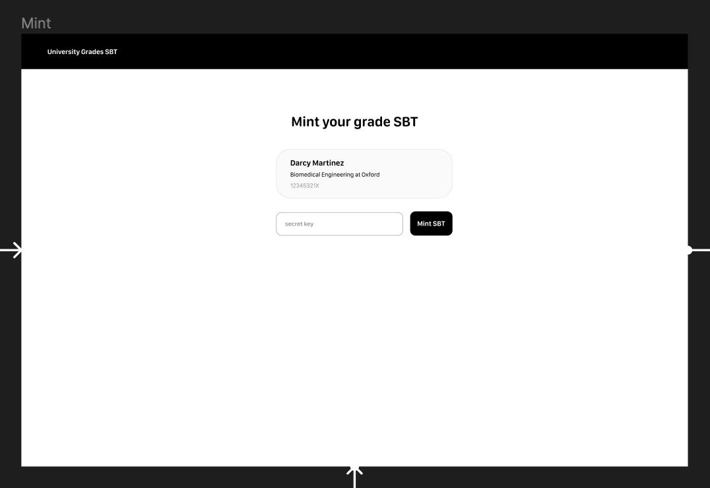
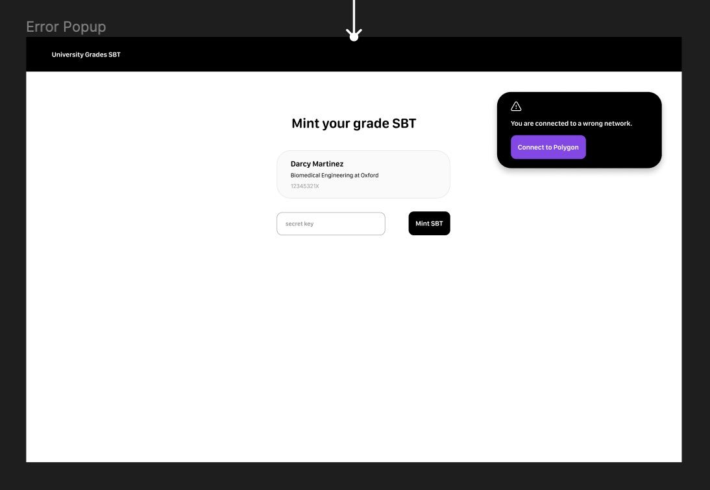
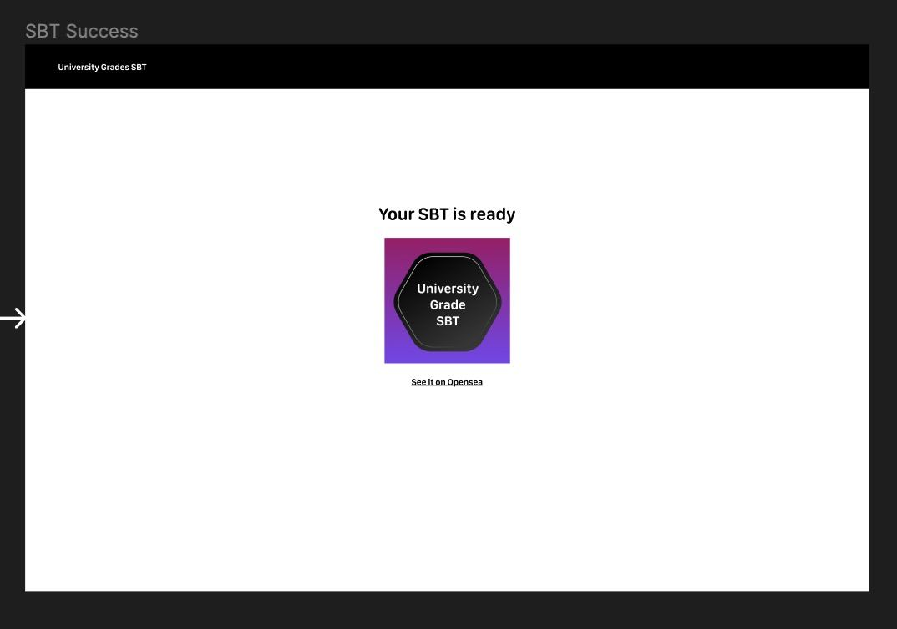

# Project
This take-home project will be based on developing an application for universities to mint they're grades as an SBT.   
To be more specific; Your application will permit to login a user with it's wallet, choose the university her/his in, fill a form with its personal information and, with a secret key, he'll be able to mint it's degree SBT to her/his wallet.  

To develop this project; Feel free to use the own tech stack you feel more comfortable with.  
Though, we do recommend:
  - [](https://reactjs.org/)  
  - [](https://www.typescriptlang.org/)
  - [](https://www.djangoproject.com/)

`There will be no penalties for using any other modern frameworks`

## [Specifications][specs]

On [this Figma](https://www.figma.com/file/YwteE14GzkoCSYXvw4CGXT/University-Grades-SBT) there is in detail all of the screens designs. Have in mind that one thing that we check is the ability of developing precisely upon design specifications. The specifications are organized by application screens, each one with its designs and functionalities.  

In the folder `media/` your gonna find all the static files you need.

1. Login with your wallet
  

  For this step, you can use industry-standard tools like [MetaMask](https://metamask.io) or [WalletConnect](https://walletconnect.com/).  
  Keep in mind that if a user already minted its grade, the next time he logs in, he'll be redirected directly to the success page.  
  No error pages are required in this screen.

2. Choose your university
    
  
  The user will be able to choose between different universities that are **provided from the backend**. Each one will contain a unique secret key that will permit later minting degrees SBTs.  
  You will be responsible of generating this universities on the DB.  
  Feel free of searching the university pictures on the internet.

3. Fill your personal information
   

  The user will be able to fill its personal information to later customize the SBT metadata.  
  The grades will be a dropdown of the different grades available **provided by the backend**.  
  You will be responsible of generating this grades on the DB. We recommend to atleast generate 5.  
  The grades are not related to a university.  

4. Minting page
   
  In this page the SBT will be previewed and it will be prompted an input to send the university secret key.  
  Until the user do not prompt the correct secret key, the minting button will be disabled and he will not mint the SBT.  
  We are aware that the secret key will be unique per university, and everyone who could have the secret key is gonna be able to mint as much degrees as she/he wants to, but since this is just a sample project, security is irrelevant.
  
  Since the SouldBound Token (SBT) is still a concept in development (proposed by [Vitalik Buterin](https://vitalik.ca/general/2022/01/26/soulbound.html) in this post) and it doesn't have any official ERC standard implementation: We refeer to an SBT as `any token non-transerrable once minted`.  
  The implementation of this restriction is totally up to you.  
  The SBT will have a custom metadata based on the User preferences as the following:

  ```json
  {
    "image": "<the-url-of:media/SBT Image/SBT University image.png uploaded>"
    "name": "Your university degree"
    "description": "This SBT is a validation of your university degree"
    "attributes": [
      {
        "trait_type": "Degree",
        "value": "<user degree>"
      },
      {
        "trait_type": "Name",
        "value": "<user name>"
      },
      {
        "trait_type": "Last name",
        "value": "<user last name>"
      }
    ]
  }
  ```
  
  If the selected network is not `Mumbai`, an error popup will appear:
    
    
  
5. Success page
   

  The success page will show the minted SBT with a redirection link to the SBT on [OpenSea](https://opensea.io/).
  
